# DENG Group Help Desk

> Your central hub for technical support and assistance

[](../../issues)
[]()

---

## 📋 Table of Contents

- [Need Help?](#-need-help)
- [Before You Submit](#-before-you-submit)
- [Expected Response Times](#expected-response-times)
- [Tracking Your Ticket](#tracking-your-ticket)
- [Getting Urgent Help](#getting-urgent-help)
- [Contact](#-contact)

---

## 🎫 Need Help?

**To get support:** [**Create a new issue**](../../issues/new/choose) and select the appropriate ticket type.

> 💡 **Don't have a GitHub account?** Contact Tim-Pook directly at [tim.pook@nus.edu.sg](mailto:tim.pook@nus.edu.sg)

### What Happens After You Submit?

```mermaid
flowchart TD
    A["📝 Submit"] --> B["👀 Acknowledged"]
    B --> C["🔧 In Progress"]
    C --> D["✅ Resolved"]
    D --> E["🎉 Closed"]
```



### Quick Start Guide

1. **Click** the "Issues" tab above or [click here](../../issues/new/choose)
2. **Select** the ticket type that best matches your request:

   | Category | When to Use | Examples |
   |----------|-------------|----------|
   | 🖥️ **Hardware Issues** | Physical equipment problems | Computer won't start, printer offline, monitor issues |
   | 💻 **Software Support** | Application problems | Can't install Python package, MATLAB license error |
   | 🔑 **Access Requests** | Need permissions or accounts | Server access, VPN setup, shared folder access |
   | 🌐 **Network Issues** | Connectivity problems | Can't connect to lab network, slow internet |
   | 💾 **Data/Storage** | Data management needs | Need more storage space, data backup, file recovery |
   | ⚡ **Computing Resources** | HPC/cluster issues | Job won't run on cluster, GPU allocation |
   | 🛒 **Procurement** | Purchasing requests | Equipment, software licenses, service subscriptions |
   | 📋 **Long-term Task** | Non-urgent projects/duties | System setup, documentation, maintenance projects |
   | ❓ **General Help** | Everything else | Questions, consultations, other requests |

3. **Fill out** the form with as much detail as possible
4. **Submit** your ticket - you'll get email updates on progress

---

## ✅ Before You Submit

**Check these first:**
- [ ] Have you tried restarting? (Seriously, it fixes 30% of issues!)
- [ ] Is this in the [FAQ](docs/faq.md)?
- [ ] Did you check [existing tickets](../../issues) for similar issues?
- [ ] Is this actually urgent, or can it wait a day or two?

### What to Include in Your Ticket

**Good tickets get faster responses!** Please include:

- ✏️ **Clear description** - What's wrong? What were you trying to do?
- 🔁 **Steps to reproduce** - How can we recreate the problem?
- ❌ **Error messages** - Screenshots or copy-paste exact errors
- 💻 **System information** - OS (Windows/Mac/Linux), software versions
- ⚡ **Priority level** - How urgent is this? (see guidelines below)
- 📧 **Contact info** - Alternative email if not in your GitHub profile

<details>
<summary><b>📖 Example of a Good Ticket</b></summary>

**Bad:** "Python doesn't work"

**Good:**
```
Title: Cannot import pandas on lab workstation

Description: I'm trying to run my data analysis script but getting an import error.

Steps to reproduce:
1. SSH into workstation-5
2. Activate conda environment: conda activate myenv
3. Run: python -c "import pandas"

Error message:
ModuleNotFoundError: No module named 'pandas'

System info:
- Workstation: workstation-5
- OS: Ubuntu 20.04
- Python version: 3.9.7
- Conda environment: myenv

Priority: Medium (blocking my work but I can use my laptop temporarily)
```
</details>

### Priority Guidelines

Choose the right priority to help us help you:

| Priority | Use When | Examples |
|----------|----------|----------|
| 🔴 **Urgent** | Critical research operations affected | Server down, data loss, grant deadline tomorrow |
| 🟠 **High** | Blocking your work, no workaround | Can't access critical files, software license expired |
| 🟡 **Medium** | Impacting work but have workaround | Slow performance, minor bugs, feature requests |
| 🟢 **Low** | Nice to have, not blocking | General questions, optimization, documentation |

### Procurement Requests

**For purchasing equipment, software, or services.** Use the **🛒 Procurement** template for:

- Hardware purchases (computers, servers, peripherals)
- Software licenses (new or renewal)
- Service subscriptions (cloud services, support contracts)
- Consumables and supplies

**Includes tracking for:** Budget source, approval status, vendor information, recurring costs

### Long-term Tasks

**For administrative and long-term projects only.** Use the **📋 Long-term Task** template for:

- **System Setup/Building**: Infrastructure projects, new lab systems
- **Documentation Projects**: Creating guides, procedures, knowledge base articles
- **Maintenance & Optimization**: System improvements, cleanup projects
- **Research & Evaluation**: Testing new tools, technology assessment

**Key features:** Flexible deadlines, milestone tracking, extended duration support (weeks to months)

> **Note:** For purchasing requests, use the Procurement template. Long-term tasks are for non-purchasing projects.

---

## ⏱️ Expected Response Times

After you submit a ticket, you can expect:

| Priority | First Response | Resolution Target |
|----------|---------------|-------------------|
| 🔴 Urgent | Same day | Same day - 1 day |
| 🟠 High | Same day | 2-3 days |
| 🟡 Medium | Within 1 day | 3-5 days |
| 🟢 Low | Within 2 days | 5-7 days |

> **Note:** These are guideline timeframes during business hours (Mon-Fri, 9 AM - 5 PM SGT). We aim to acknowledge all tickets promptly so you know we've seen them. Complex issues may take longer to resolve. Response times may be slower during holidays and weekends.

**Business Hours:** Monday - Friday, 9:00 AM - 5:00 PM (Singapore Time)
**After Hours:** Emergency issues only (see below)

---

## 🔍 Tracking Your Ticket

**You'll automatically receive:**
- 📧 Email notifications when your ticket is updated
- 🔔 GitHub notifications (if you have an account)

**To check your tickets:**
- View all your tickets: [Your Issues](../../issues?q=is%3Aissue+author%3A%40me)
- View all open tickets: [Open Issues](../../issues)

**Understanding Status Labels:**

| Label | What It Means | What You Should Do |
|-------|---------------|-------------------|
| `status: new` | Just submitted, in queue | Wait for acknowledgment |
| `status: acknowledged` | Tim has seen it | Expect updates soon |
| `status: in-progress` | Being worked on | Check for questions from Tim |
| `status: waiting-for-user` | Need info from you | **Respond ASAP** to avoid delays |
| `status: resolved` | Fixed, needs confirmation | **Test and confirm** it works |
| `status: closed` | All done! | Rate your experience (optional) |

> 💡 **Tip:** If your status is `waiting-for-user` for more than 7 days, the ticket may be automatically closed.

---

## 🚨 Getting Urgent Help

**For emergency issues that affect critical research operations:**

1. ⚡ Mark your ticket as **Priority: Urgent**
2. 📢 Include "URGENT" in the title
3. 📞 If no response within 2 hours during business hours, contact Tim directly:
   - Email: [tim.pook@nus.edu.sg](mailto:tim.pook@nus.edu.sg)
   - Subject line: "URGENT: [brief description]"

**What qualifies as urgent?**
- ✅ Server/critical system is down
- ✅ Data loss or corruption
- ✅ Grant/paper deadline in <24 hours and blocking issue
- ✅ Security incident or breach
- ❌ Forgot password (use password reset)
- ❌ Want feature faster (not urgent)
- ❌ Question about how to use something (not urgent)

---

## 📚 Additional Resources

**Documentation:**
- ❓ [FAQ](docs/faq.md) - Frequently asked questions and solutions
- ⏰ [Deadline & Reporting System](docs/deadline-and-reporting-system.md) - How deadlines are tracked and reports generated
- 📖 [DENG Group Intranet](https://intranet.matsci.dev/Orientation/get-started) - On-boarding and computing guides

**Self-Service:**
- 🔍 [Search existing tickets](../../issues) - Someone may have had your issue before

**Quick Troubleshooting:**
<details>
<summary>Common quick fixes to try first</summary>

- **Can't connect to network:** Restart your computer, check VPN connection
- **Software won't install:** Check if you have admin rights, try restarting
- **File won't open:** Check file extension, try opening with different program
- **Slow computer:** Close unused programs, restart, check disk space
- **Forgot password:** Use self-service password reset (link in FAQ)

</details>

---

## 📞 Contact

**Computer Officer:** Tim Pook
- 📧 Email: [tim.pook@nus.edu.sg](mailto:tim.pook@nus.edu.sg)
- ⏰ Office Hours: Monday - Friday, 9:00 AM - 5:00 PM (SGT)

**Preferred Contact Methods:**
1. 🎫 **Create a ticket** (recommended - tracks progress and creates documentation)
2. 📧 **Email Tim** (for urgent issues or if you don't have a GitHub account)

> **No GitHub account?** No problem! Email Tim directly at [tim.pook@nus.edu.sg](mailto:tim.pook@nus.edu.sg) and he'll create a ticket on your behalf.

---

## 🤝 Help Us Improve

We're always looking to make this help desk better!

- 💭 **Have feedback?** Email Prof. Deng or Tim
- ⭐ **Satisfied with support?** Give the ticket a 👍 reaction
- 🐛 **Found an issue with this system?** Email Tim about it

---

## 📊 Help Desk Statistics

Want to see how we're doing? Check our:
- 📈 [Weekly Reports](../../issues?q=is%3Aissue+label%3Areport) (published weekly)
- 📉 [Current Open Tickets](../../issues)
- ⏱️ Average response time: ~24 hours

---

<div align="center">

**Questions?** | **Need Help?** | **System Issues?**
:---: | :---: | :---:
[Check FAQ](docs/faq.md) | [Create Ticket](../../issues/new/choose) | [Email Tim](mailto:tim.pook@nus.edu.sg)

*Last updated: 2025-10-11*

</div>
